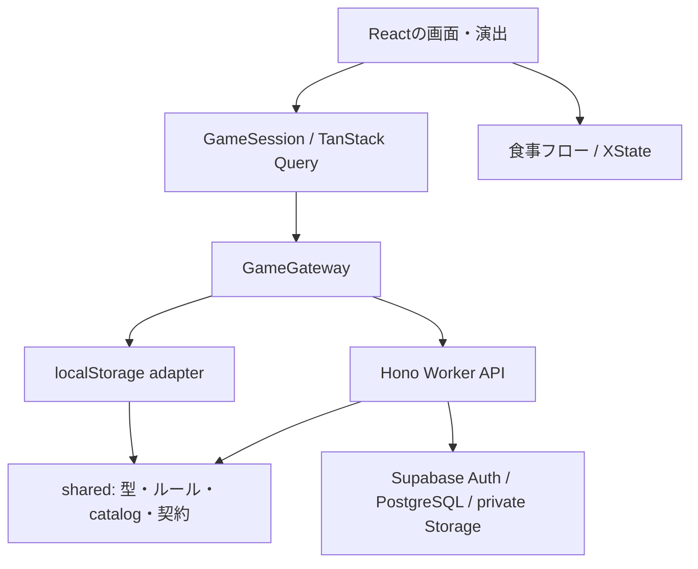

# もぐ日和のアーキテクチャ

もぐ日和は、Reactで画面を描画するSPAと、Cloudflare WorkerのHTTP APIで構成する。育成ルールと採用コンテンツはブラウザ・Workerに共通のTypeScriptモジュールを使う。ローカル体験とクラウド保存の違いは、画面から呼ぶ保存窓口で吸収する。

インフラの準備と動作確認は [infrastructure.md](./infrastructure.md) を参照する。

## 依存関係

| 場所                                               | 担当                                                   |
| -------------------------------------------------- | ------------------------------------------------------ |
| `src/app/`                                         | ルーティング、読み込み・更新状態、保存先の接続         |
| `src/features/auth/`                               | ログイン、匿名ユーザー、Google連携、セッション         |
| `src/features/meal/`                               | 食事の下書き、写真処理、料理選択、確定までの進行       |
| `src/services/`                                    | UIから見た共通操作と、local/cloudそれぞれの保存方法    |
| `src/ui/`                                          | dialogや写真表示など、機能をまたいで使う表示部品       |
| `shared/types.ts`                                  | ゲーム状態・入力のTypeScript型                         |
| `shared/game.ts`                                   | 育成・報酬・購入などのルールと参照関数                 |
| `shared/commands.ts`                               | 名前付き操作をルールへ変換する入口                     |
| `shared/catalog.ts`, `shared/recipes.ts`           | 採用コンテンツの正本                                   |
| `shared/contracts.ts`, `shared/schemas.ts`         | HTTPと保存データの実行時検証                           |
| `shared/receipt.ts`                                | 確定した給餌1回分の演出用結果                          |
| `shared/saveMigrations.ts`, `shared/stateCodec.ts` | 既存セーブの移行と検証                                 |
| `worker/`                                          | HTTP、認証、操作再送、DB・画像サービスへの接続         |
| `supabase/migrations/`                             | DBテーブル、整合性を保つ関数、実行権限、private bucket |

`shared/`はReact、ブラウザの保存領域、`src/`、Worker bindingに依存しない。日付と食事IDは呼出元から渡す。`src/game.ts`、`src/recipes.ts`、`src/content/`の再exportは既存画面向けの互換窓口であり、Workerは直接`shared/`を参照する。

## 状態の所有者

保存済みゲームは`GameSession`のQuery cacheで保持する。キーには保存先のidentityを含め、localとアカウントごとの状態を分ける。操作成功時は返されたsnapshotを反映し、既に取得したrevisionより古い応答で状態を巻き戻さない。定期取得と画面再フォーカスで他端末の変更を取り込む。

dialogの開閉、図鑑のタブ、表示中の演出などはReactの状態に置く。食事の写真・入力・選択・処理中状態はXStateに置く。永続化する`GameState`を別のグローバルstoreへ複製しない。

TanStack Routerは`/`、`/book`、`/album`、`/shop`、`/auth/callback`を扱う。画面URLと保存済みゲームは別の責務とする。旧URLの`#book`等は対応するpathへ移す。

`GameState.xp`は既存保存形式との互換のため、選択中のなかまのXPを表す値として残っている。個体別XPの正本は`companions`であり、ゲームルールと保存移行で同期する。この互換値を独立して更新しない。

## 名前付き操作

画面はstate全体を自由に書き換えず、`execute(command, operationId)`を呼ぶ。

| 操作                               | 入力                                             |
| ---------------------------------- | ------------------------------------------------ |
| `chooseStarter`, `selectCompanion` | なかまの`id`                                     |
| `feed`                             | タイトル、料理・対象のID、写真参照、表示用sample |
| `purchase`, `equip`                | アイテムの`id`                                   |
| `rest`, `claimLogin`               | 追加の入力なし                                   |
| `updateSettings`                   | 名前・リマインダー設定                           |
| `tutorial`                         | step、status、homeGuide                          |

ブラウザは獲得XP・コイン増分・価格・報酬日を指定しない。給餌による成長、カード、来客、通貨、おやすみ券の返却は、`feed`が一括で計算する。

日付送り・試用ジェム追加・リセットは別の`DemoCommand`であり、local gatewayだけが提供する。cloudのコマンドschemaには含めない。

### 再送と確定結果

HTTPリクエストは`{ operationId, command }`、応答は`{ snapshot: { state, revision }, receipt }`とする。意図した1操作に1個のUUIDを発行し、同じ操作の通信再試行には同じIDを使う。

cloudではWorkerが現在の状態を読み、固定した日付・食事IDで次の状態を計算する。DB関数`commit_game_command`がユーザーの行をロックし、期待revision、操作ID、写真の所有者・使用状態を確認して一括確定する。競合時はWorkerが最新状態から最大2回再計算する。既に完了したIDには元のreceiptを返し、同じIDで異なる入力が来た場合は409にする。

local gatewayは同じ画面向けAPIを提供するが、再送記録とrevisionはgatewayインスタンス内のメモリにある。複数ブラウザや再読み込みをまたぐcloud同等のトランザクション保証は持たない。localStorageの保存に失敗した場合は成功結果を返さず、画面の入力を維持する。

`FeedReceipt`は、食事ID・獲得量・対象の成長前後XP・新しいカードや来客・ストリークなど、その給餌だけを表す。写真本体、全食事履歴、before/afterの全snapshotは含めない。別端末の更新を食後の演出へ混ぜないため、演出はreceiptを入力にする。演出の再生や早送りで報酬を付与しない。

## 食事フローと演出

XStateの`editing`内で、画面の進行と写真処理を並行して管理する。写真処理から料理選択・食卓へ進んでも認識を続けられる。写真の差し替えやキャンセルでは古いactorの結果を採用しない。認識のPromise actorには`AbortSignal`を渡し、HTTPリクエストも中止する。画像のデコード処理そのものには中断APIを追加しておらず、遅い完了結果を無視する。

料理やタイトルを手動で編集した後に、遅れて届いた認識結果で上書きしない。`submitting`中は重複の確定入力を受け付けず、保存失敗時は下書きを持った食卓へ戻る。同じ下書きの再送では操作IDを維持する。成功時にreceiptを受け取り、食後の演出へ進む。

MotionはXP表示など画面内の補間に使う。View Transitionsは場面切り替えに使う。描画はReactのDOM/SVGを維持し、ルール計算や保存完了の判定を演出時間に結び付けない。

下書きは現在の画面のメモリにある。再読み込みをまたぐIndexedDB保存や自動再送は未実装である。

## 写真・コンテンツ・保存互換

localの写真は従来どおり縮小したData URLをセーブに含める。cloud gatewayは写真を先にWorkerへ送信し、給餌コマンドには`photoId`だけを渡す。写真と食事の紐付けはDBの確定処理内で行う。表示時は所有者を確認して発行した短期間のURLを使い、URLを永続的な写真IDとして保存しない。

採用レシピは`shared/recipes.ts`で既存10件と追加300件を合成する。UI、保存時のカード検証、ゲームルール、写真認識は同じregistryを参照する。既存レシピIDと`rice` / `pasta` / `soup` / `curry`のsample値は維持する。追加レシピの画像は`artPath`で表示する。追加キャラクター・着せ替えの採用はレシピの採用と別に扱う。

local保存の`mogubiyori-v1`は既存セーブを移行して読み込む。単体のチュートリアル設定が不正でも、写真・成長・通貨を捨てない。共有codecは不正なセーブで例外を返す。localの互換窓口だけが欠損・破損を初期状態へ置き換える。cloudでは読込失敗や未対応データをエラーとして扱い、空のゲームで上書きしない。

## 機能を並行して開発するとき

1. 機能固有の画面・処理は`src/features/<機能>/`にまとめる。共通表示だけを`src/ui/`へ置く。
2. ゲーム状態を変更する機能は、sharedの操作・型・schemaを先に決め、WorkerとUIで同じ契約を使う。
3. UIからDBやlocalStorageを直接更新しない。Workerから`src/`をimportしない。
4. 新しい報酬はゲームルールで計算し、必要な演出情報をreceiptへ追加する。React側で報酬を再計算しない。
5. 永続化する項目の変更では既存セーブの移行、初期状態、cloud schema、テストを一緒に更新する。コンテンツIDを変更・廃止する場合は過去の所持・記録の扱いも決める。
6. 同時作業は別worktreeとbranchで行い、shared契約とrouteの変更を担当者間で共有する。生成物だけを手で変更せず、コンテンツの正本と生成手順を更新する。

## 検証の境界

Vitestは純粋ルール、保存移行、契約、食事machine、Worker APIとサービスadapterを検証する。Playwrightは操作の流れ・入力保持・再読み込み・アクセシビリティを確認し、E2E中の料理認識はmockにする。DB関数の権限・原子性・同時再送は、隔離PostgreSQLを起動する`supabase/tests/run-local.sh`で検証する。

これらの検証と、実際のSupabase Auth/Storage・Workers AI・公開URLでの確認は別に記録する。SQLの成功だけではGoogle連携や写真のHTTP経路を確認したことにはならない。
