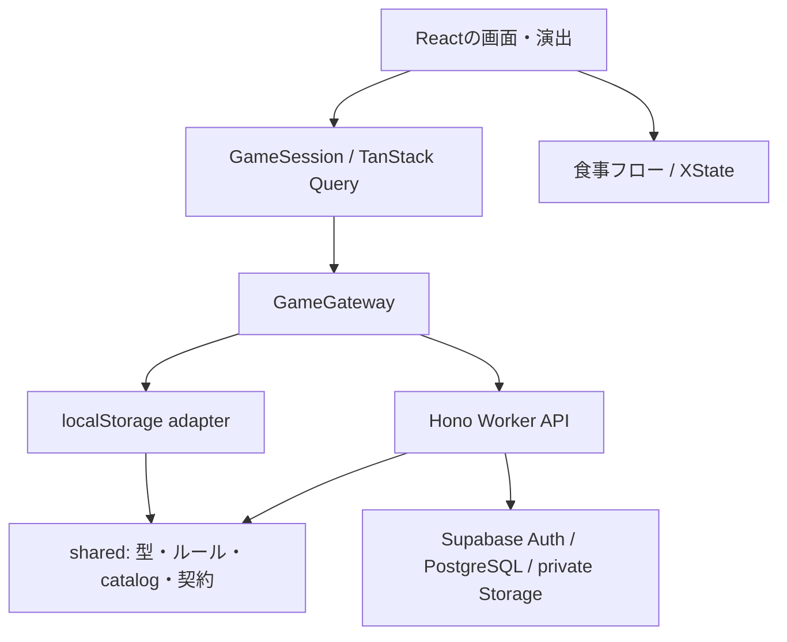

# もぐ日和のアーキテクチャ

もぐ日和は、Reactで画面を描画するSPAと、Cloudflare WorkerのHTTP APIで構成する。育成ルールと採用コンテンツはブラウザ・Workerに共通のTypeScriptモジュールを使う。ローカル体験とクラウド保存の違いは、画面から呼ぶ保存窓口で吸収する。

インフラの準備と動作確認は [infrastructure.md](./infrastructure.md) を参照する。

## 依存関係

| 場所                                          | 担当                                                                               |
| --------------------------------------------- | ---------------------------------------------------------------------------------- |
| `src/app/`                                    | アプリの構成、route、dialogの切り替え、CSSの読込順                                 |
| `src/app/game/`                               | 保存セッション、Query cache、local/cloud gateway、ブラウザの時刻・IDとlocalStorage |
| `src/features/room/`、`companions/`           | ひろば、最初のなかま選び、なかま一覧、成長の表示                                   |
| `src/features/collection/`、`album/`、`shop/` | ずかんと料理詳細、ごはんの記録、おみせと各機能のpanel                              |
| `src/features/meal/`                          | 食事の下書き、写真処理、料理選択、確定までの進行                                   |
| `src/features/feast/`、`streak/`、`tutorial/` | 食後と連続記録のお祝い、初回案内                                                   |
| `src/features/auth/`                          | ログイン、匿名ユーザー、Google連携、認証セッション                                 |
| `src/features/settings/`                      | 設定とあそびかたのpanel                                                            |
| `src/ui/`                                     | 複数機能で使う描画、`Sheet`、`JourneyFrame`などの表示部品                          |
| `src/styles/`                                 | 全体の基礎スタイル、共通テーマ                                                     |
| `shared/game/`                                | ゲーム状態・型、ルール、command、契約・schema、receipt、保存移行                   |
| `shared/meals/`                               | 実食記録の型・schema、材料からの食品群提案、日次・7日間の集計                      |
| `src/features/nutrition/`                     | 今日のスコア、7日間のグラフ、食品群の推移                                          |
| `shared/content/`                             | 採用catalogとレシピ、追加コンテンツの型と変換                                      |
| `worker/`                                     | HTTPの入口、共通エラー、環境binding                                                |
| `worker/game/`                                | 操作再送・確定、repository契約、Supabase Auth・DB・Storage接続                     |
| `worker/recognition/`                         | 料理写真の認識、入力・モデル出力の検証                                             |
| `supabase/migrations/`                        | DBテーブル、整合性を保つ関数、実行権限、private bucket                             |

`shared/`はReact、ブラウザの保存領域、`src/`、Worker bindingに依存しない。日付と食事IDは呼出元から渡す。`src/app/game/browserGame.ts`はブラウザ用の日付・IDを補う入口を保ち、Workerは直接`shared/`を参照する。ブラウザのcloud gatewayからWorkerへの参照は、Hono clientのための`AppType`の型importに限る。

## 機能内の配置

機能の画面・固有部品・状態遷移・CSS・単体テストを同じ`src/features/<機能>/`へ置く。たとえば食事は`meal/`内に`MealJourney.tsx`、`mealMachine.ts`、`mealMachine.test.ts`、写真処理とCSSをまとめる。複数機能で使う描画は`src/ui/art/`、共通の進行画面枠と切り替えは`src/ui/journey/`へ置く。

なかま選びの`StarterSelection`となかま一覧の`FriendsBoard`は`companions/`、料理一覧の`RecipeBoard`と詳細の`RecipeDetail`は`collection/`が担当する。dialogの中身も担当featureへ置き、`src/app/dialogs/GameDialogs.tsx`は表示するpanelの切り替えを担当する。routeから開くページは各featureに置き、`src/app/router.tsx`から接続する。

CSSは機能の近くに置くが、読み込みは`src/app/styles.ts`へ集める。基礎・機能・テーマの順番を明示し、routeの読み込み時期で既存のcascadeが変わらないようにする。CSSの場所を移すだけの変更ではセレクターや値を変えない。機能のCSSを追加するときも、この入口で読み込む順序を決める。

## 状態の所有者

保存済みゲームは`GameSession`のQuery cacheで保持する。キーには保存先のidentityを含め、localとアカウントごとの状態を分ける。操作成功時は返されたsnapshotを反映し、既に取得したrevisionより古い応答で状態を巻き戻さない。定期取得と画面再フォーカスで他端末の変更を取り込む。

cloudの`AuthGate`は保存済みセッションの復元を待ち、セッションがない場合は匿名認証を自動で行う。認証方法を選ぶ画面は置かない。Google連携と既存アカウントへのGoogleログインは設定画面に置き、連携は同じユーザーIDを保つ`linkIdentity`、ログインは`signInWithOAuth`を使う。別ユーザーの記録を合算せず、アカウント変更時はidentityに対応したゲームへ切り替える。ログアウト後は新しい匿名ユーザーで始める。

dialogの開閉、ずかんのタブ、表示中の演出などはReactの状態に置く。食事の写真・入力・選択・処理中状態はXStateに置く。永続化する`GameState`を別のグローバルstoreへ複製しない。

TanStack Routerは`/`、`/book`、`/album`、`/shop`、`/auth/callback`を扱う。画面URLと保存済みゲームは別の責務とする。旧URLの`#book`等は対応するpathへ移す。

`GameState.xp`は既存保存形式との互換のため、選択中のなかまのXPを表す値として残っている。個体別XPの正本は`companions`であり、ゲームルールと保存移行で同期する。この互換値を独立して更新しない。

## 名前付き操作

画面はstate全体を自由に書き換えず、`execute(command, operationId)`を呼ぶ。

| 操作                               | 入力                                                                           |
| ---------------------------------- | ------------------------------------------------------------------------------ |
| `chooseStarter`, `selectCompanion` | なかまの`id`                                                                   |
| `feed`                             | タイトル、料理・対象のID、写真参照、表示用sample、食事内容または共有する記録ID |
| `updateMealRecord`                 | 記録ID、食べた日、タイトル、食事時間、料理と食品群                             |
| `purchase`, `equip`                | アイテムの`id`                                                                 |
| `rest`, `claimLogin`               | 追加の入力なし                                                                 |
| `updateSettings`                   | 名前・ごはんのお知らせの設定                                                   |
| `tutorial`                         | step、status、homeGuide                                                        |

ブラウザは獲得XP・コイン増分・価格・報酬日を指定しない。給餌による成長、カード、来客、通貨、おやすみチケットの返却は、`feed`が一括で計算する。

日付送り・試用ジェム追加・リセットは別の`DemoCommand`であり、local gatewayだけが提供する。cloudのコマンドschemaには含めない。

### 再送と確定結果

HTTPリクエストは`{ operationId, command }`、応答は`{ snapshot: { state, revision }, receipt }`とする。意図した1操作に1個のUUIDを発行し、同じ操作の通信再試行には同じIDを使う。

cloudではWorkerが現在の状態を読み、固定した日付・食事IDで次の状態を計算する。DB関数`commit_game_command`がユーザーの行をロックし、期待revision、操作ID、写真の所有者・使用状態を確認して一括確定する。競合時はWorkerが最新状態から最大2回再計算する。既に完了したIDには元のreceiptを返し、同じIDで異なる入力が来た場合は409にする。

local gatewayは同じ画面向けAPIを提供するが、再送記録とrevisionはgatewayインスタンス内のメモリにある。複数ブラウザや再読み込みをまたぐcloud同等のトランザクション保証は持たない。localStorageの保存に失敗した場合は成功結果を返さず、画面の入力を維持する。

`FeedReceipt`は、食事ID・獲得量・対象の成長前後XP・新しいカードや来客・連続記録など、その給餌だけを表す。写真本体、全食事履歴、before/afterの全snapshotは含めない。別端末の更新を食後の演出へ混ぜないため、演出はreceiptを入力にする。演出の再生や早送りで報酬を付与しない。

人が食べた1回は`GameState.mealRecords`、もぐへの給餌は既存の`meals`に保存し、`mealRecordId`で参照する。共有では既存の食事記録と写真を使い、新しい給餌だけを追加する。食品群とスコアは実食を集計し、記録の編集で報酬を再計算しない。`FeedReceipt.mealReport`には確定時点の今日と7日間の要約を入れ、食後の画面はこの値を使う。履歴画面は現在の記録を同じ純粋関数で集計する。旧セーブに実食記録がない場合はそのまま読み込み、食品群を作り出さない。[食事レポートの仕様](meal-reports.md)

## 食事フローと演出

XStateの`editing`内で、画面の進行と写真処理を並行して管理する。写真処理から料理選択・食卓へ進んでも認識を続けられる。写真の差し替えやキャンセルでは古いactorの結果を採用しない。認識のPromise actorには`AbortSignal`を渡し、HTTPリクエストも中止する。画像のデコード処理そのものには中断APIを追加しておらず、遅い完了結果を無視する。

料理やタイトルを手動で編集した後に、遅れて届いた認識結果で上書きしない。`submitting`中は重複の確定入力を受け付けず、保存失敗時は下書きを持った食卓へ戻る。同じ下書きの再送では操作IDを維持する。成功時にreceiptを受け取り、食後の演出へ進む。

MotionはXP表示、カテゴリの選択表示、通知、dialogの開閉と内容切替に使う。dialogは閉じる演出が完了するまでnative modalを保ち、その後に呼出元へフォーカスを戻す。View Transitionsは場面切り替えとroute間の遷移に使い、routeではヘッダーとナビゲーションの位置を保ちながら選択マークを移動する。端末の「動きを減らす」設定では移動や拡大縮小を省く。描画はReactのDOM/SVGを維持し、ルール計算や保存完了の判定を演出時間に結び付けない。

下書きは現在の画面のメモリにある。再読み込みをまたぐIndexedDB保存や自動再送は未実装である。

## 写真・コンテンツ・保存互換

localの写真は従来どおり縮小したData URLをセーブに含める。cloud gatewayは写真を先にWorkerへ送信し、給餌コマンドには`photoId`だけを渡す。写真と食事の紐付けはDBの確定処理内で行う。表示時は所有者を確認して発行した短期間のURLを使い、URLを永続的な写真IDとして保存しない。

採用レシピは`shared/content/recipes.ts`で既存10件と追加300件を合成する。UI、保存時のカード検証、ゲームルール、写真認識は同じregistryを参照する。既存レシピIDと`rice` / `pasta` / `soup` / `curry`のsample値は維持する。追加レシピの画像は`artPath`で表示する。追加のなかま・きせかえの採用はレシピの採用と別に扱う。

具体的なレシピを特定しない料理は、`shared/content/dishes.ts`の種類を任意の`dishId`として食事に保存する。写真認識と食事の選択肢は`mealChoices.ts`でレシピと種類を合わせて参照する。`recipeId`は引き続き料理カードの対象を示し、種類だけの記録でカードやカード報酬を付与しない。種類の記録は未分類の食事と同じ45 XPと通常の日次・継続報酬を得る。既存セーブでは`dishId`の追加は不要で、読込・API・receiptのschemaはいずれも任意項目として扱う。

local保存の`mogubiyori-v1`は既存セーブを移行して読み込む。単体のチュートリアル設定が不正でも、写真・成長・通貨を捨てない。共有codecは不正なセーブで例外を返す。localの互換窓口だけが欠損・破損を初期状態へ置き換える。cloudでは読込失敗や未対応データをエラーとして扱い、空のゲームで上書きしない。

## 機能を並行して開発するとき

1. 機能固有の画面・部品・処理・CSS・単体テストは`src/features/<機能>/`にまとめる。共通表示は`src/ui/`、アプリ全体の接続は`src/app/`へ置く。
2. ゲーム状態を変更する機能は、sharedの操作・型・schemaを先に決め、WorkerとUIで同じ契約を使う。
3. UIからDBやlocalStorageを直接更新しない。Workerから`src/`をimportしない。
4. 新しい報酬はゲームルールで計算し、必要な演出情報をreceiptへ追加する。React側で報酬を再計算しない。
5. 永続化する項目の変更では既存セーブの移行、初期状態、cloud schema、テストを一緒に更新する。コンテンツIDを変更・廃止する場合は過去の所持・記録の扱いも決める。
6. 同時作業は別worktreeとbranchで行い、shared契約・route・`src/app/styles.ts`の変更を担当者間で共有する。生成物だけを手で変更せず、コンテンツの正本と生成手順を更新する。

## 検証の境界

Vitestの単体テストは`src/`、`shared/`、`worker/`で対象実装の隣へ置く。純粋ルール、保存移行、契約、食事machine、Worker APIとサービスadapterを検証する。ブラウザの保存互換・採用コンテンツ・cloud gatewayとWorkerの接続など、複数の境界を横断するテストは`tests/integration/`へ残す。sharedの単体テストからfrontendへ依存させない。

Playwrightは`tests/e2e/`でlocalの操作・入力保持・再読み込み・アクセシビリティを、`tests/cloud/`でmockのAuth・APIを使うcloudの操作を確認する。E2E中の料理認識もmockにする。DB関数の権限・原子性・同時再送は、隔離PostgreSQLを起動する`supabase/tests/run-local.sh`で検証する。

これらの検証と、実際のSupabase Auth/Storage・Workers AI・公開URLでの確認は別に記録する。SQLの成功だけではGoogle連携や写真のHTTP経路を確認したことにはならない。
