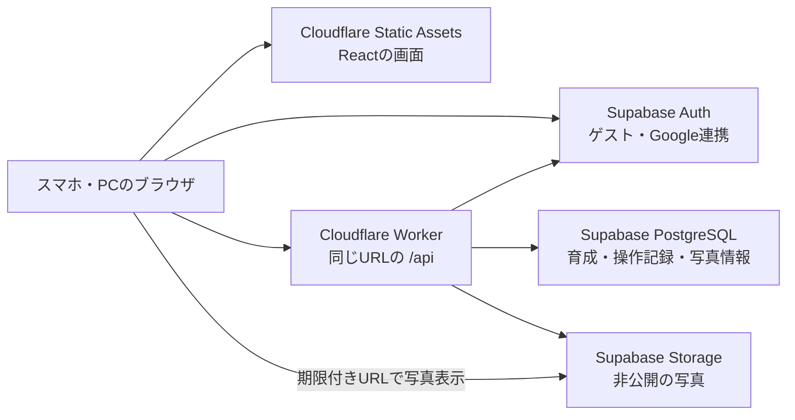

> 2026-09-24時点の設計記録です。現行の実装・接続手順は[実行環境とクラウド接続](../infrastructure.md)を参照してください。以下の設計案には未実装の運用機能も含まれます。

# もぐ日和のインフラ方針

設計日: 2026-09-24。対象はハッカソン・限定体験の数十人、無料枠中心。設計上の試算は50人・30日間とする。これは実装・デプロイ前の設計であり、クラウド資源は未作成。

**Cloudflare Workersで画面とAPIを配信し、Supabase Freeで認証・PostgreSQL・非公開の写真を管理する。** 育成ルールは既存のTypeScriptをサーバーでも使い、操作単位で保存する。初期費用の目標は月額 $0、独自ドメインは任意とする。

## 1. 対象となるゲーム

別タスク「自炊版Duolingoのデモ作成」は設計中に完了した。完了コミット `78f6a97` のコードと仕様から、次を前提にする。

- 3匹から最初のなかまを選び、食事で成長。おとなのもとへ来たお客さんに食べさせると仲間になる。
- 個体別の経験値、同じ料理の連続によるXP減少、レシピカード初獲得、着せ替え。
- 日本時間の日付を基準とするログイン・自炊・ストリーク報酬、おやすみチケット。
- 料理の自己申告と写真。写真認識、実決済、他人への写真公開は現行仕様にない。

React / TypeScript / ViteのSPAで、ルールは `src/game.ts`、保存は `src/gameStorage.ts`。`mogubiyori-v1` に写真のData URLを含む全状態を保存している。`src/photo.ts` は写真を長辺800px・JPEG品質0.72へ縮小するが、出力バイト数は保証していない。

最初のクラウド化では、端末を替えても育成を続けられること、保存失敗を認識できること、複数端末・再送でも通貨や記録が壊れないことを完成条件にする。

## 2. 採用する構成



| 担当            | 採用                             | 理由                                                                                 |
| --------------- | -------------------------------- | ------------------------------------------------------------------------------------ |
| HTTPS・静的配信 | Workers Static Assets            | 現在の `dist/` を利用。最初は `workers.dev` のURLで公開できる                        |
| ゲームAPI       | 同じWorkerの `/api/*`            | フロントと同じTypeScriptのルールを再利用。秘密鍵と報酬計算をサーバーへ置く           |
| ユーザー        | Supabase Auth                    | ゲスト開始からGoogle連携へ移行できる                                                 |
| 保存            | Supabase PostgreSQL              | 更新の競合、二重処理、途中失敗をトランザクションで扱える                             |
| 写真            | Supabase private Storage         | DBへ画像本体を入れず、ユーザーごとの閲覧を制御できる                                 |
| 地域            | SupabaseのTokyo `ap-northeast-1` | 日本からの利用を想定。WorkerはCloudflare側の配置であり、全処理の国内限定を意味しない |

WorkerとSupabase間はHTTP APIを使う。初期はDBの直接TCP接続、接続プールの追加、別のAPIサーバーを用意しない。Supabaseへ往復する時間は実機で測定する。

静的ファイルへのリクエストは無料・無制限だが、WorkerのAPIには別の無料枠がある。`run_worker_first` はAPIだけに指定し、画面・画像・フォントを毎回Worker経由にしない。[Static Assetsの料金](https://developers.cloudflare.com/workers/static-assets/billing-and-limitations/)、[SPAルーティング](https://developers.cloudflare.com/workers/static-assets/routing/single-page-application/)、[Supabaseの地域](https://supabase.com/docs/guides/platform/regions)

## 3. ユーザーとログイン

### 初回から引き継ぎまで

1. 「はじめる」でSupabaseの匿名ユーザーを作り、専用のUUIDを得る。ページ表示だけでは作成しない。
2. 最初のなかまを選ぶ。育成と写真は最初からそのUUIDに保存する。
3. 初回の食事後や設定に「Googleと連携して引き継ぐ」を置く。連携は任意。
4. 新しいGoogle identityの連携には `linkIdentity` を使い、同じUUIDに認証手段を追加する。別ユーザーへセーブをコピーしない。
5. 別端末ではGoogleログインし、既存の状態を読み込む。

匿名のままログアウト・サイトデータ削除・別ブラウザへの変更をすると、本人であることを証明する手段がなくなる。「ゲストの記録はこのブラウザから続けられます。引き継ぐにはGoogle連携」と案内する。Supabaseでは匿名ユーザーも `authenticated` ロールなので、SQLの `anon` ロールと混同しない。[匿名ログインとidentity連携](https://supabase.com/docs/guides/auth/auth-anonymous)

すでにそのGoogleアカウントでゲームを持っている場合は、既存のセーブへ切り替える。切り替え前に画面で伝え、ゲストと既存アカウントの通貨・育成は自動合算しない。新規連携、既存ログイン、連携キャンセルを別々に検証する。

### 認証の実装境界

- OAuthのPKCE・トークン更新はSupabase SDKに任せる。Google側のcallbackと、Supabaseからゲームへ戻るURLをそれぞれ設定する。
- WorkerへはBearerトークンを送る。初期実装は `auth.getUser(token)` で認証し、その結果のUUIDだけをDBアクセスに使う。リクエスト本文の `userId` や、デコードしただけのJWTを信用しない。
- 公開可能なURL・publishable keyと、Worker Secretに入れるサーバー専用キーを分ける。サーバーキー、DBパスワード、Google client secretを `VITE_*` に入れない。
- アプリ用テーブルはRLSを有効にし、ブラウザからの直接読み書きを許可しない。ゲームの保存RPCも `PUBLIC` / `anon` / `authenticated` から実行不可にし、サーバー用ロールのみ許可する。Workerの管理権限はRLSを迂回するため、APIでも必ずUUID・所有者を検査する。
- ブラウザに保持するセッションはSDK管理とし、料理名はReactの通常のテキスト描画を使う。認証トークン・写真URL・写真本体をログに残さない。

[getUserによる認証確認](https://supabase.com/docs/reference/javascript/auth-getuser)、[DB関数の実行権限](https://supabase.com/docs/guides/database/functions)

### 会場で必要な準備

匿名ログインにはTurnstileを有効にする。標準ではIPあたり30回/時の制限があるため、同じ会場Wi-Fiで数十人が開始すると詰まる可能性がある。事前に想定参加人数と再試行分を踏まえて設定し、会場回線で試す。匿名ユーザーの自動清掃機能はないため、終了後の整理は自分たちで行う。[匿名ログインの制限](https://supabase.com/docs/guides/auth/auth-anonymous)

初期はGoogle連携を採用し、メール認証は後回しにする。Supabase標準SMTPはプロジェクトチーム外への送信に使えず、現在は2通/時の制限もある。メールOTPを追加するなら、独自SMTPと送信ドメインの設定まで含める。[SMTPの制約](https://supabase.com/docs/guides/auth/auth-smtp)

限定体験は公開URLを参加者へ配布する運用を想定する。招待された人だけが利用できる厳密なアクセス制限が必要になった場合は、別途サーバーで招待を確認する。URLを知らせないことを認可の仕組みにはしない。

## 4. 永続化は3テーブルから始める

Supabaseの認証用テーブルとは別に、アプリ用の表を次の3つに絞る。

| テーブル          | 主な内容                                                                                         | 制約・役割                                                                                      |
| ----------------- | ------------------------------------------------------------------------------------------------ | ----------------------------------------------------------------------------------------------- |
| `game_states`     | `user_id`, `revision`, `schema_version`, `rules_version`, `state jsonb`, `status`, `updated_at`  | ユーザーごとに1行。育成、所持品、残高、日次報酬、料理記録、名前・設定を保持                     |
| `game_operations` | `user_id`, `operation_id`, `request_hash`, `kind`, `receipt`, `committed_revision`, `created_at` | `(user_id, operation_id)` を一意にし、再送の結果を記録。receiptは報酬差分・料理IDなど小さく保つ |
| `photo_assets`    | `id`, `user_id`, `object_key`, `bytes`, `mime`, `status`, `meal_id`, `created_at`                | 画像本体への参照と所有者。アップロード済み・食事へ紐付け済みを区別                              |

`GameState`をそのまま外から受け取って保存するAPIは作らない。DBに置く状態から写真Data URL・デモ日付オフセットを除き、写真は `photoId` に置き換える。表示用の「選択中キャラのXP」は個体別XPから導出する。

記録は数十人・数週間ならJSONB内で扱える。これは限定体験向けの簡素化であり、長期の履歴検索・ランキング・分析には向かない。状態の大きさとAPIのCPU時間を測り、履歴が増えたら `meals` を独立させる。目安として1ユーザーのsnapshotが100KBを超え始めた時点で見直し、APIの無料CPU枠へ近づくなら先に対応する。

操作ごとに過去の全snapshotを保存すると容量が急増するので、`game_operations`には全状態を複製しない。体験期間中は操作IDを保持し、アカウント削除時に削除する。古い操作IDを消す場合は、再実行を拒否する期間設計を先に追加する。

## 5. 操作APIと二重付与の防止

### APIの形

| API                          | 用途                                                                     |
| ---------------------------- | ------------------------------------------------------------------------ |
| `GET /api/game`              | 保存状態・revision・サーバーの日本時間の日付を取得                       |
| `POST /api/game/commands`    | 最初の選択、食事、ログイン報酬、休み券、購入、着せ替え、設定変更         |
| `POST /api/photos`           | 縮小済みBlobをアップロードし、`photoId`を返す                            |
| `POST /api/photos/read-urls` | 所有者を確認し、表示する写真の期限付きURLをまとめて返す                  |
| `DELETE /api/account`        | アカウント削除を開始し、再実行可能な手順で写真・記録・認証ユーザーを削除 |

コマンドの例:

```json
{
  "operationId": "クライアントで一度だけ生成するUUID",
  "type": "feed",
  "input": {
    "targetId": "komugi",
    "recipeId": "curry",
    "title": "今日のカレー",
    "photoId": "アップロード済み写真のID"
  }
}
```

クライアントはXP、コイン増分、販売価格、報酬日を指定しない。1回の意図した操作に1つのIDを発行し、ダブルタップ・通信再送では同じIDを使う。別の食事は新しいIDにする。

### 保存の手順

1. Workerがユーザーを認証し、入力・対象キャラ・レシピ・写真の所有者を検査する。
2. 同じ操作IDが完了済みなら保存済みreceiptを返す。入力内容が異なるID再利用は409にする。
3. DBから現在の状態とrevisionを取得。Workerの時刻から日本時間の日付を与え、共通のTypeScriptルールで次の状態を計算する。
4. サーバー専用の `commit_game_operation` RPCへ、期待revision・新状態・receiptを渡す。
5. RPCは1トランザクションでユーザーの行をロックし、操作IDを再確認する。revisionが一致する場合だけ状態更新・写真の紐付け・操作記録をまとめて確定する。
6. 別端末の操作でrevisionが変わっていたら全体を未更新にして返す。Workerは最新状態から再計算して最大2回再試行し、それでも競合する場合は再読込可能な409を返す。古い状態を上書きしない。

最初のユーザー行作成も一意制約とトランザクションで扱う。写真は同じトランザクション内でも所有者・未使用・利用可能状態を再確認し、同じ写真を別の食事へ二重消費しない。

ゲームルールは `src/game.ts` からブラウザ非依存部分を共通モジュールへ抽出する。時間とID生成は引数にしてテスト可能にする。SQLは保存の整合性に専念し、育成ルールをTypeScriptとSQLへ二重実装しない。RPCへ渡す新状態は、信頼されたWorkerがDBの現状から計算した値に限定する。

ログイン報酬とその日最初の食事報酬は、別IDで再要求されても状態内の受取履歴で二重付与しない。カード報酬、ストリーク報酬、休み券返却、購入済みアイテムも同じ競合制御の下で判定する。日付は、そのHTTP要求をWorkerが受け付けた時刻を日本時間に変換し、同一要求内の競合再試行では固定する。未完了操作を翌日新たに再送した場合は、その再送受付日を使う。すでに確定した操作の再送では元のreceiptを返す。

「育った」「購入した」の確定表示は保存成功後。応答が失われた場合は同じIDで結果を確認する。確定済み状態が取れないときに `initialGame()` へ戻して上書きしない。

料理は自己申告のまま。サーバー管理で防ぐのは残高・日付・操作の改変であり、写真から実際に自炊したかを保証するものではない。

## 6. 写真とオフライン時の扱い

### 保存経路

1. 端末で縮小・再エンコードし、Data URLではなくJPEG Blobにする。長辺800pxを初期値とし、平均200KB程度を目標、1枚300KB以下に収める。容量を超えたら品質・寸法を段階的に下げる。
2. `POST /api/photos` でWorkerへ送る。認証後にサイズ・許可した画像形式・ファイル先頭を確認する。無料Worker上で画像の再エンコードはしない。
3. `photo_assets`にpending行を作り、非公開bucketの `userId/photoId.jpg` へ保存してreadyにする。オブジェクトキーはサーバーで生成する。
4. 食事コマンドが `photoId` を参照し、ゲーム状態の確定と同時に写真情報を紐付ける。
5. 表示時はWorkerが所有者を確認し、短時間、例えば5分有効のURLを発行する。期限付きURLはDBの永続参照に使わず、期限切れ時に取得し直す。

小さな画像をWorker経由で送る構成にして、初期は署名アップロード予約APIなどを増やさない。Storageのブラウザ直接アップロード権限は閉じる。bucketにも300KB上限と許可MIMEを設定し、クライアントの圧縮だけを容量制限にしない。

通常のアップロードではcanvas再エンコードにより元のEXIFを引き継がない。サーバーで全画像の再エンコードを保証する構成ではないため、将来他ユーザーへの公開機能を作る際は、検証・変換処理を追加する。

private bucketと期限付きURLのアクセスモデルは[Storageの公式仕様](https://supabase.com/docs/guides/storage/buckets/fundamentals)に従う。URLの有効期間中はURLを持つ人が閲覧できるため、共有機能として露出しない。

### 途中失敗と通信切断

- 写真アップロードとDB保存は一つのトランザクションにはできない。食事保存に失敗した場合は同じ `photoId` と操作IDで再試行する。
- 写真送信にもリクエストIDを付け、応答消失で同じ画像を無制限に増やさない。pendingのままでも同じキーの保存有無を調べて再開できるようにする。
- 24時間を超えた未使用写真は、DBで清掃対象へ変更してからStorage APIで削除する。食事への紐付けと清掃が競合しないよう、同じ行の状態で排他する。削除失敗は次回に再試行する。
- ネットが切れたら写真・入力・操作IDをIndexedDBの下書きに残し、「未送信」と表示する。通信復帰後に再試行し、成功前にXPや報酬は確定させない。
- 前日分へ遡る登録やオフライン中の購入は初期対象外。下書きが翌日になったら「送信した日の記録になる」と表示する。
- 下書きとキャッシュはユーザーUUIDごとに分ける。アカウント切り替え時に別人の下書きを自動送信しない。

## 7. 無料枠と運用費

2026-09-24に公式料金ページで確認。既存アカウントの利用量・空きプロジェクト数は未確認であり、実装時に確認する。

| 項目           | 初期利用枠                     | 今回の見立て                                        |
| -------------- | ------------------------------ | --------------------------------------------------- |
| 静的配信       | リクエスト無料・無制限         | イラスト・フォントはここで配信                      |
| Worker API     | 10万リクエスト/日、1回10ms CPU | 50人×100回/日なら5,000回。CPUは別途実測が必要       |
| Supabase Auth  | 50,000 MAU                     | ゲストを含め数十人なら人数より他の制約が先          |
| PostgreSQL     | 500MB                          | 写真を入れなければ初期規模では余裕を見込みやすい    |
| 写真           | 1GB                            | 最も先に注意する枠                                  |
| Supabase転送量 | 通常5GB、cached egress 5GB     | 合算10GBを自由に使えるとは扱わず、まず通常5GBで試算 |

[Workers料金](https://developers.cloudflare.com/workers/platform/pricing/)、[Supabase料金](https://supabase.com/pricing)

写真の概算は `人数 × 1日の枚数 × 日数 × 平均サイズ`。50人×1枚×30日×200KB ≒ **300MB**、1日3枚なら約900MB。1,500枚を各5回ダウンロードすると約1.5GB、写真の増分バックアップで約300MB、計約1.8GBに加えてAPI・DBバックアップ転送分が発生する。キャッシュによる削減はこの試算に含めない。写真を毎日全量取り直すと、30日でバックアップだけで約4.65GBになるので避ける。

写真は遅延読込し、毎回全履歴分のURL・画像を読み込まない。Storage使用量700MB、転送量3.5GBを見直しの目安にし、90%付近では新規写真アップロードを止められる設定を用意する。料理記録と育成は写真なしでも継続できるようにする。容量のために保存済み写真を無断で消さない。

Workerの10msは通信待ちを含むレスポンス時間ではなくCPU枠。JSON解析・ルール計算・署名URL処理を実測し、余裕がなければ履歴の分離やAPI処理の見直しを先に行う。画像変換は端末で行う。

無料プランには休止・容量超過などによる利用不能がある。毎日使われる一般公開へ移行するときは、Supabase Proの月額$25から、Workerの上位枠が必要なら月額$5からを再見積もりする。独自ドメイン、SMTP、画像バックアップ先、実決済手数料はこの$0構成に含まない。[Supabase料金](https://supabase.com/pricing)、[Workers料金](https://developers.cloudflare.com/workers/platform/pricing/)

## 8. デプロイと環境

### リポジトリへ追加するもの

```text
worker/index.ts                  /apiと認証・入力検証
src/shared/game.ts               サーバーとブラウザ共通の育成ルール
src/services/gameClient.ts       コマンド送信・再送・状態取得
src/services/auth.ts             Supabase Auth
src/services/drafts.ts           ユーザー別の未送信下書き
supabase/migrations/             3テーブル、RLS、保存RPC
wrangler.jsonc                   Workerとdistの配信設定
.github/workflows/deploy.yml     検証と公開
```

配置は実装時の案。完了したゲームのルールと画面へ合わせて抽出する。React全体のフレームワーク移行は不要。

### 公開手順

1. CloudflareとSupabase Freeを用意し、Tokyoの体験用プロジェクトと非公開bucketを作る。
2. DB migration、RPC実行権限、認証・Google・Turnstileを設定する。Google側でテストユーザー指定が必要な構成では参加者を登録して検証する。
3. Worker Secretにサーバー専用キーを登録する。フロントにはSupabase URLとpublishable keyだけを渡す。
4. Nodeとパッケージマネージャーを固定し、lockfileからインストール。現行READMEのnpm方式なら `npm ci` を用いる。npm/pnpmの両lockfileを運用上の正本にはしない。
5. unit test、lint、build、E2E、DBの権限・競合テストをCIで通す。`wrangler deploy` でWorkerと `dist/` を同時に公開する。
6. 安定した公開URLの `/auth/callback` をSupabaseの許可リストへ登録。Google側はSupabaseのOAuth callbackを設定する。実端末で新規ゲスト・連携・別端末復帰を試す。

`wrangler.jsonc` の配信部分は次の形にする。

```jsonc
{
  "name": "mogubiyori",
  "main": "worker/index.ts",
  "compatibility_date": "2026-09-24",
  "assets": {
    "directory": "./dist",
    "binding": "ASSETS",
    "not_found_handling": "single-page-application",
    "run_worker_first": ["/api/*"],
  },
}
```

APIはJSONの404を返し、SPAのHTMLへフォールバックさせない。`/api/game`と認証付き応答には `Cache-Control: no-store`、ハッシュ付き静的資産には長期キャッシュ、HTMLには再検証を設定する。

開発はローカルSupabaseを基本とし、クラウドの体験データにテストを流さない。必要なら2つ目のFreeプロジェクトをstagingへ使うが、既存利用の空きを確認する。PRプレビューへ体験環境のサーバーキーを配布しない。OAuthの試験用URLは固定stagingにする。

DB変更は追加→コード切替→後日整理の順で行い、直前のWorker版でも読める期間を設ける。コードの巻き戻しでDBは巻き戻らない。CIでDB migration成功を確認してから、そのschemaに対応するWorkerを公開する。

## 9. 保存を失わないための運用

Supabase Freeは1週間の非活動で休止し、自動バックアップを利用できない。イベント前日と当日に、起動・認証・写真・保存を通して確認する。無料枠を休止しない常設サービスとして扱わない。[料金・休止条件](https://supabase.com/pricing)

限定体験の開始前、体験日の終了後、DB変更前にバックアップを取る。継続して毎日使う期間は日次にする。

- DB: schema・関数・権限・アプリデータをエクスポート。認証のUUIDとidentityも復旧できるよう、Authを含む公式の移行・復元手順を採用し、対象を確認する。アプリ表だけのdumpを完全バックアップと呼ばない。
- 写真: object keyとチェックサムのmanifestを作り、新規objectだけ増分コピーする。保存済みobjectは上書きしない。DBバックアップにはStorageの画像本体は含まれない。
- 保管: 運営者の暗号化した端末と別媒体など、Supabaseとは別の場所にDB・manifestを7世代保存し、各manifestから参照する画像本体を保持する。別媒体への複製も手元から行い、Supabaseから二重に取得しない。公開Gitや公開CI成果物へ置かない。
- 復旧: 別環境でUUID、育成、所持品、写真、Googleでの再ログインまで復元を試す。写真とDBの時点ずれはmanifestで検出する。

DBのroles・schema・dataは[CLIによるバックアップと復元手順](https://supabase.com/docs/guides/platform/migrating-within-supabase/backup-restore)を基準にする。Auth/Storageの追加ポリシー、OAuth設定、bucket設定、Worker Secretsも復旧対象として別途管理し、新しいプロジェクトへ移る場合は接続先・callbackを更新する。旧ゲストのセッションが別プロジェクトでそのまま使えるとは約束せず、プロジェクト全損からの復旧後は連携済みアカウントでの再ログインを基本とする。

まずは「最大1日程度の記録を失う可能性」「運営者が当日中に復旧する」を目標とする。いずれも復元演習前の目標であり、保証ではない。[Supabaseのバックアップ仕様](https://supabase.com/docs/guides/platform/backups)

写真清掃は日次のWorker scheduled handlerから実行し、1回の件数を制限する。写真容量、APIエラー、認証失敗、保存競合、Worker CPUをダッシュボードで確認する。ログはoperation ID、処理種別、結果、時間を中心にする。

アカウント削除は `status=deleting` として新しい操作を止め、写真→写真情報・操作履歴→認証ユーザーの順に処理する。`game_states`のdeleting行は認証ユーザー削除の成功まで残し、最後に削除する。Auth削除失敗時も進捗と新規操作の禁止を保ち、認証済みなのに行がないためゲームを新規作成する事故を防ぐ。退会済みデータをバックアップ復元で再公開しないよう、削除記録を復元後にも反映する。

## 10. 既存デモからの移行

初期方針は**クラウドで新しいセーブを開始し、既存のブラウザ内デモは残す**。既存データは日付送り、試用ジェム、サンプル履歴を含められるため、その残高をクラウドの正規報酬へ変換しない。

ローカル体験版は別のURLまたは明示的なモードで維持できる。クラウド版には日付送り・ジェム追加の操作を公開せず、サーバーにも対応コマンドを作らない。初期クラウド版の有料ジェム販売は無効にする。

将来引き継ぎが必要になったら、元データのダウンロード、schema検証、写真の個別転送、一度だけの取込を設計する。現在の `parseGame` は不正データで初期状態を返すため、移行検証にはそのまま流用せず、失敗理由を返す厳密な検証を用意する。

## 11. 実装順序と公開確認

1. 静的公開とゲスト認証、3テーブル、状態取得を接続する。
2. 共通ルールとコマンドAPIを作り、最初の選択→食事→育成→再読込を通す。
3. 写真、Google連携、別端末復帰、未送信下書きを接続する。
4. 権限・競合・日付変更・通信失敗とバックアップ復元を検証し、数十人へ配布する。

公開前に通すシナリオ:

- AさんのトークンでBさんの状態・写真へアクセスできない。ブラウザから保存RPCや表へ直接書けない。
- 同じ食事の同時送信、応答消失後の再送で記録・XP・通貨が1回分になる。
- 別端末からログイン報酬を請求しても1日1回。残高不足に近い状態で同時購入してもマイナスにならない。
- カード初獲得、連続料理のXP、3日/7日報酬、おやすみ後の食事による券返却が現在のゲーム仕様と一致する。
- 日本時間0時、送信途中の翌日、端末時計変更を試す。チケット使用と食事の同時操作も整合する。
- 写真だけ成功、DBだけ失敗、アップロード応答消失、未使用写真の清掃中の確定を試す。
- Google新規連携・既存セーブへのログイン・キャンセル・サイトデータ削除後の復帰を試す。
- 50人相当のデータとイベント時の同時開始で、会場回線・認証制限・CPU・保存時間を測る。無料枠内で動くことはこの実測で判断する。

## 12. 拡張するときの判断

| 変化               | 次の対応                                                                      |
| ------------------ | ----------------------------------------------------------------------------- |
| 写真だけ増える     | 圧縮・表示回数を測り、Storage増量かR2への写真だけの移行を比較                 |
| 常設公開する       | Supabase有料プラン、日次バックアップ自動化、運営への障害通知を追加            |
| 履歴が増える       | `meals`を独立しページ取得へ。全状態・全履歴の毎回送信を解消                   |
| 実決済を始める     | 決済Webhook、注文・通貨台帳、返金、二重付与防止を追加。有償と試用の通貨を分離 |
| 写真判定を導入する | まず任意の提案機能として非同期処理を追加。APIキーはサーバー管理               |
| 通知を始める       | 許可・通知先・配信停止を持つ通知設計を追加。現状の催促の口調設定だけでは不要  |

比較した代替案:

- **Cloudflare D1 + R2**: D1には無料の復旧期間、R2には大きめの無料容量がある。一方で認証の組合せと写真の権限管理が必要。今回はAuth込みのSupabaseを先に採用し、写真が増えた場合のR2は候補として残す。R2は無料枠付きの従量課金サービスとして登録する。[D1制限](https://developers.cloudflare.com/d1/platform/limits/)、[R2料金](https://developers.cloudflare.com/r2/pricing/)、[R2開始手順](https://developers.cloudflare.com/r2/get-started/)
- **Firebase**: AuthとFirestoreは候補になるが、現在Cloud Storage利用にはBlazeが必要。写真付きゲームを無料枠中心で始める今回の第一候補にはしない。[Storageの課金要件](https://firebase.google.com/docs/storage/faqs-storage-changes-announced-sept-2024)
- **VPS / 自前PostgreSQL**: 一台へまとめられるが、OS更新、バックアップ、復旧、認証の運用が増える。今回の人数と期間ではマネージド構成を選ぶ。
